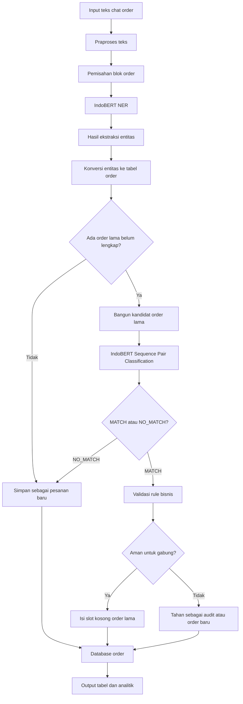
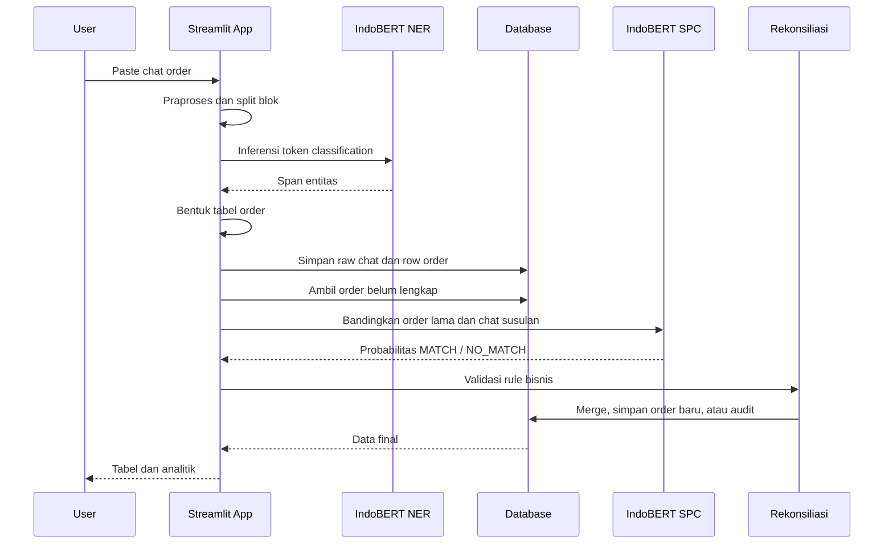

# KOMBINASI NAMED ENTITY RECOGNITION DAN SEQUENCE PAIR CLASSIFICATION MENGGUNAKAN DUA VARIAN FINE-TUNING INDOBERT

Dokumen ini merupakan draft deskripsi sistem untuk Bab 4, khususnya bagian
Perancangan dan Implementasi Sistem. Fokus utama sistem adalah pemanfaatan
deep learning berbasis IndoBERT untuk mengekstraksi informasi order logistik
dari teks percakapan tidak terstruktur, kemudian mencocokkan pesanan susulan
dengan pesanan awal agar data operasional dapat dilengkapi secara otomatis.

## 1. Deskripsi Umum Sistem

Sistem yang dikembangkan adalah aplikasi Intelligent Document Processing (IDP)
untuk data order logistik berbasis teks chat. Data input berasal dari pesan
operasional yang formatnya tidak selalu baku, misalnya terdapat variasi penulisan
seperti `REQUEST ORDER`, `REQEST ORDER`, `REQUEST ORDER ULANG`, kesalahan label
seperti `lodng`, `DRVER`, `Nopoll`, serta campuran format tanggal, jam, plat,
driver, dan nomor telepon.

Permasalahan utama yang diselesaikan sistem adalah:

1. Mengubah teks chat order menjadi data tabel operasional.
2. Mengidentifikasi atribut penting seperti tanggal RO, waktu muat, lokasi
   pickup, tujuan, tipe kendaraan, driver, nomor plat, dan kontak driver.
3. Membedakan pesanan baru dan pesanan susulan.
4. Mencocokkan pesanan susulan dengan order lama yang belum lengkap.
5. Menggabungkan data susulan ke slot order yang kosong tanpa mengubah order
   lain yang tidak relevan.
6. Menampilkan hasil ekstraksi, hasil rekonsiliasi, dan analitik performa model.

Pendekatan utama sistem menggunakan dua varian fine-tuning IndoBERT:

1. IndoBERT untuk Named Entity Recognition (NER), yaitu token classification
   untuk menandai entitas order pada level token.
2. IndoBERT untuk Sequence Pair Classification (SPC), yaitu klasifikasi pasangan
   teks untuk menentukan apakah pesanan susulan cocok dengan pesanan awal.

Dengan kombinasi tersebut, sistem tidak hanya mengekstraksi data dari teks,
tetapi juga memahami hubungan antar pesan dalam konteks rekonsiliasi order.

## 2. Tujuan Implementasi Sistem

Implementasi sistem dirancang untuk mendukung proses operasional logistik yang
sebelumnya bergantung pada pembacaan manual chat. Secara teknis, tujuan sistem
adalah:

1. Menyediakan pipeline ekstraksi data berbasis NER.
2. Menyediakan pipeline pencocokan order berbasis sequence pair classification.
3. Menyimpan hasil ekstraksi ke database agar dapat diproses bertahap.
4. Menampilkan output dalam format tabel menyerupai kebutuhan laporan order.
5. Menyediakan analitik jumlah row, status kelengkapan data, dan hasil
   rekonsiliasi.
6. Menyediakan lingkungan pengujian untuk skenario pesanan baru, pesanan
   susulan, negative test, dan stress test.

## 3. Ruang Lingkup Sistem

Ruang lingkup sistem pada penelitian ini dibatasi pada pemrosesan teks chat
order logistik. Sistem tidak membahas optimasi rute kendaraan, pelacakan GPS,
perhitungan biaya pengiriman, atau integrasi langsung dengan sistem ERP
eksternal.

Input utama sistem adalah teks chat yang memuat informasi order. Output utama
sistem adalah tabel order dengan kolom:

1. No.
2. Tgl RO
3. Tgl Muat
4. Pickup
5. Tujuan
6. No. Plat
7. Type Truck
8. Driver
9. Kontak Driver

## 4. Arsitektur Sistem

Secara garis besar, sistem terdiri dari lima lapisan:

1. Lapisan input, yaitu area teks pada aplikasi Streamlit untuk memasukkan chat.
2. Lapisan praproses, yaitu normalisasi format chat dan pemisahan blok order.
3. Lapisan model deep learning, yaitu NER dan Sequence Pair Classification.
4. Lapisan rekonsiliasi, yaitu logika pengisian slot kosong dan validasi konflik.
5. Lapisan output, yaitu tabel hasil ekstraksi, audit, database, dan analitik.

Diagram arsitektur sistem:



Alternatif diagram dalam bentuk teks:

```text
Input Chat
   |
   v
Praproses dan Split Order
   |
   v
Model 1: IndoBERT NER
   |
   v
Tabel Ekstraksi Order
   |
   v
Cek Kandidat Order Belum Lengkap
   |
   +--> Jika tidak ada kandidat: simpan sebagai order baru
   |
   +--> Jika ada kandidat:
          |
          v
       Model 2: IndoBERT Sequence Pair Classification
          |
          v
       MATCH / NO_MATCH
          |
          +--> MATCH: validasi konflik dan isi slot kosong
          +--> NO_MATCH: simpan sebagai order baru
```

## 5. Pipeline Pemrosesan Data

Pipeline sistem berjalan secara bertahap dari input teks sampai output tabel.
Tahapan tersebut adalah sebagai berikut.

### 5.1 Input Chat

Pengguna memasukkan teks chat order ke aplikasi. Chat dapat berisi satu order
atau banyak order sekaligus. Format chat tidak wajib seragam karena sistem
dirancang untuk menangani variasi penulisan lapangan.

Contoh variasi input:

```text
REQUEST ORDER ONCALL 01 MEI 2026
2 UNIT TWB 50 CBM
Lokasi : CIKARANG
Waktu loading : 06:00/ 02-05-2026
Rute/tujuan : CGK - SUB
Driver : Asep
Nopol : L 1411 YA
No hp : +62 821-120-0000
```

### 5.2 Praproses Teks

Praproses bertujuan membuat teks lebih stabil sebelum masuk ke model. Pada
tahap ini sistem melakukan:

1. Menghapus metadata chat yang tidak relevan.
2. Menormalkan label field yang sering salah tulis.
3. Menghapus baris noise operasional yang tidak mengandung atribut order.
4. Menyamakan pola label seperti `DRVER`, `DRIVERR`, dan `NAMA` menjadi
   konteks driver.
5. Menyamakan pola label `Nopol`, `Nopoll`, dan `No pol`.
6. Menyiapkan teks agar sesuai dengan tokenizer IndoBERT.

Tahap ini tidak mengganti makna data, tetapi menurunkan variasi format agar
model lebih konsisten melakukan inferensi.

### 5.3 Split Blok Order

Jika input berisi banyak order, sistem memecah teks menjadi beberapa blok.
Pemisahan dilakukan berdasarkan sinyal header order seperti:

1. `REQUEST ORDER`
2. `REQUEST ORDER ULANG`
3. `Request Unit On Call`
4. `REQEST ORDER`
5. `REQUER ORDER`
6. `ONCALL`
7. pola jumlah unit, misalnya `5 UNIT CDDL 24 CBM`

Tahap ini penting karena satu input chat dapat berisi beberapa pesanan dengan
tanggal, lokasi, dan tujuan berbeda.

## 6. Model 1: Named Entity Recognition

Model pertama adalah IndoBERT yang di-fine-tuning untuk tugas Named Entity
Recognition. Tugas model ini adalah memberi label pada token yang berisi
informasi order.

Jenis arsitektur yang digunakan:

```text
Input teks chat
   |
   v
IndoBERT Tokenizer
   |
   v
IndoBERT Encoder
   |
   v
Token Classification Head
   |
   v
Label entitas per token
```

Entitas yang diekstraksi meliputi:

1. Tanggal RO.
2. Tanggal atau waktu muat.
3. Lokasi pickup.
4. Tujuan pengiriman.
5. Jumlah unit.
6. Tipe kendaraan.
7. Nama driver.
8. Nomor plat kendaraan.
9. Kontak driver.

Output NER berupa span entitas. Span tersebut kemudian dikelompokkan menjadi
row tabel order. Jika sebuah order berisi lebih dari satu unit, sistem membuat
beberapa baris sesuai jumlah unit yang terdeteksi.

Contoh hasil konseptual:

```text
Tgl RO        : 01 MEI 2026
Tgl Muat      : 06:00/ 02-05-2026
Pickup        : CIKARANG
Tujuan        : CGK - SUB
Type Truck    : TWB 50 CBM
Driver        : Asep
No. Plat      : L 1411 YA
Kontak Driver : +62 821-120-0000
```

Model NER pada implementasi disimpan pada:

```text
models/indobert_NER/final_model
```

Pada aplikasi, model dimuat menggunakan `AutoModelForTokenClassification`.

## 7. Model 2: Sequence Pair Classification

Model kedua adalah IndoBERT yang di-fine-tuning untuk tugas Sequence Pair
Classification. Model ini menerima dua teks sebagai input:

1. Teks atau ringkasan order lama.
2. Teks chat pesanan susulan.

Tujuannya adalah menentukan apakah kedua teks tersebut merujuk pada order yang
sama atau bukan.

Arsitektur konseptual:

```text
Teks A: order lama / order state
Teks B: chat susulan
        |
        v
IndoBERT tokenizer dengan input pasangan teks
        |
        v
IndoBERT encoder
        |
        v
Sequence classification head
        |
        v
Output: MATCH atau NO_MATCH
```

Label utama model:

1. `MATCH`, yaitu pesanan susulan dianggap cocok dengan order lama.
2. `NO_MATCH`, yaitu pesanan susulan tidak cocok dan lebih aman diperlakukan
   sebagai order baru atau perlu audit.

Model Sequence Pair Classification pada implementasi utama disimpan pada:

```text
models/indobenchmark/indobert-base-p2_15k/final_model
```

Pada aplikasi, model dimuat menggunakan `AutoModelForSequenceClassification`.

## 8. Integrasi NER dan Sequence Pair Classification

Kombinasi dua model dilakukan secara berurutan. Model NER bertugas mengubah
chat menjadi data tabel. Setelah data tabel terbentuk, sistem mengecek apakah
database memiliki order lama yang belum lengkap. Jika ada, sistem membuat
representasi order lama sebagai kandidat dan mengirimkannya bersama chat masuk
ke model Sequence Pair Classification.

Alur integrasi:

1. Chat masuk diproses oleh NER.
2. NER menghasilkan baris order.
3. Sistem mengambil order lama yang statusnya belum lengkap.
4. Setiap kandidat order lama dibandingkan dengan chat masuk.
5. SPC menghasilkan probabilitas `MATCH` dan `NO_MATCH`.
6. Jika hasil cocok dan lolos aturan bisnis, data susulan mengisi slot kosong.
7. Jika tidak cocok, data disimpan sebagai order baru atau ditahan untuk audit.

Integrasi ini membuat sistem tidak hanya mengenali entitas, tetapi juga
memahami konteks lanjutan antar pesan.

## 9. Mekanisme Rekonsiliasi Pesanan Susulan

Rekonsiliasi dilakukan ketika ada order lama yang belum lengkap. Contohnya
order awal membutuhkan 5 unit, tetapi baru 2 unit yang memiliki data driver,
plat, dan nomor HP. Jika kemudian masuk chat susulan berisi 3 unit tambahan,
sistem mencoba menggabungkannya ke order awal.

Sistem menggunakan beberapa indikator:

1. Tanggal RO.
2. Pickup.
3. Tujuan.
4. Tipe kendaraan.
5. Jumlah target unit.
6. Identitas unit, yaitu driver, plat, dan kontak driver.
7. Skor probabilitas dari model SPC.

Jika model memprediksi `MATCH`, sistem tetap melakukan validasi berbasis aturan
bisnis. Validasi ini diperlukan agar model tidak menggabungkan data yang
seharusnya berbeda, misalnya tanggal RO berbeda, rute berbeda, pickup berbeda,
atau jumlah unit melebihi slot kosong.

Keputusan rekonsiliasi dapat berupa:

1. Gabung otomatis.
2. Duplikat, sehingga tidak perlu disimpan ulang.
3. Order baru.
4. Perlu review manual.
5. Conflict, yaitu ada sinyal cocok tetapi atribut penting berubah.

## 10. Penyimpanan Data

Sistem menggunakan database untuk menyimpan data chat mentah, hasil ekstraksi,
dan audit pencocokan. Secara konseptual terdapat tiga kelompok data utama:

1. Raw chat, yaitu teks asli yang dimasukkan pengguna.
2. Order dataset, yaitu hasil ekstraksi dalam bentuk baris order.
3. Stage 2 match audit, yaitu riwayat hasil pencocokan SPC.

Struktur penyimpanan utama:

```text
raw_chats
   - id
   - chat_hash
   - chat_text
   - created_at

order_dataset
   - id
   - raw_chat_id
   - tgl_ro
   - tgl_muat
   - pickup
   - tujuan
   - no_plat
   - type_truck
   - driver
   - kontak_driver
   - status_unit
   - created_at

stage2_match_audits
   - id
   - raw_chat_id
   - candidate_key
   - predicted_label
   - p_match
   - p_no_match
   - confidence
   - decision_status
   - policy_reason
   - created_at
```

Pada versi pengujian fitur sesi, setiap sesi ekstraksi dapat dipisahkan dalam
workspace tersendiri sehingga data dan analitik antar sesi tidak tercampur.

## 11. Antarmuka Sistem

Aplikasi dibangun menggunakan Streamlit. Antarmuka menyediakan beberapa bagian:

1. Input chat pesanan.
2. Tombol untuk menjalankan ekstraksi.
3. Tabel hasil ekstraksi menyerupai format operasional.
4. Filter status data, misalnya semua, lengkap, dan belum lengkap.
5. Analitik NER.
6. Analitik pencocokan order.
7. Informasi model dan metrik training.
8. Dataset sampler untuk pengujian model.
9. Mode pengujian sesi untuk memisahkan data per sesi.

Tab utama yang relevan untuk penelitian:

1. Live Test.
2. Ekstraksi dan Rekonsiliasi.
3. Evaluasi Performa Model.
4. Model Info.

## 12. Alur Implementasi Sistem

Alur implementasi sistem dalam aplikasi adalah sebagai berikut:

1. Pengguna memasukkan teks chat.
2. Sistem menjalankan praproses dan split blok order.
3. Model NER melakukan inferensi token classification.
4. Span NER dikelompokkan menjadi baris tabel.
5. Baris disimpan ke database.
6. Jika ada order lama belum lengkap, sistem membangun kandidat pencocokan.
7. Model SPC menghitung probabilitas `MATCH` dan `NO_MATCH`.
8. Sistem menjalankan aturan validasi rekonsiliasi.
9. Data yang cocok mengisi slot kosong.
10. Output akhir ditampilkan sebagai tabel dan analitik.

Diagram implementasi:



## 13. Komponen Project

Beberapa file dan folder penting dalam project:

```text
stage2_pair_visual_test.py
    Aplikasi visual test utama untuk NER, rekonsiliasi, analitik, dan model info.

stage2_pair_visual_test copy.py
    Lingkungan pengujian aman untuk fitur sesi.

db/
    Modul koneksi database, persistence, schema, dan workspace sesi.

models/
    Artefak model hasil fine-tuning IndoBERT.

src/data_processing/
    Modul pendukung persiapan dan pemrosesan data.

src/inference/
    Modul pipeline inferensi.

src/training/
    Modul training model.

data/chat/processed/SPC/
    Dataset sequence pair classification.

test_case/
    Kumpulan skenario pengujian pesanan baru, pesanan susulan, negative test,
    dan stress test.

tests/
    Unit test dan regression test untuk menjaga logic sistem.
```

## 14. Skenario Pengujian Sistem

Pengujian dilakukan dengan beberapa jenis test case:

1. Pesanan baru, yaitu chat awal yang berisi order baru.
2. Pesanan susulan, yaitu chat lanjutan yang melengkapi slot kosong.
3. Negative test NER, yaitu input yang tidak normal untuk menguji apakah model
   overfitting pada template tertentu.
4. Negative test rekonsiliasi, yaitu kasus tanggal, rute, pickup, tipe unit,
   atau identitas kendaraan yang konflik.
5. Stress test campuran, yaitu pesanan baru dan susulan yang diacak urutannya.

Tujuan pengujian adalah memastikan bahwa:

1. NER mampu mengekstraksi atribut dari format chat bervariasi.
2. SPC mampu membedakan order cocok dan tidak cocok.
3. Rekonsiliasi tidak menggabungkan order yang salah.
4. Output akhir tetap stabil ketika data diproses bertahap.
5. Filter analitik seperti data lengkap dan belum lengkap sesuai dengan kondisi
   akhir setelah rekonsiliasi.

## 15. Peran Deep Learning dalam Sistem

Deep learning menjadi inti sistem karena masalah yang dihadapi tidak cukup
diselesaikan dengan pencocokan string sederhana. Format chat lapangan bersifat
tidak konsisten, mengandung typo, noise, singkatan, dan variasi bahasa.

NER digunakan karena sistem harus memahami token mana yang merupakan driver,
plat, nomor HP, tujuan, waktu muat, dan atribut lain. Sequence Pair
Classification digunakan karena sistem harus memahami apakah dua pesan berbeda
sebenarnya merujuk ke order yang sama.

Dengan kata lain:

1. NER menjawab pertanyaan: "Informasi apa saja yang ada dalam chat?"
2. SPC menjawab pertanyaan: "Apakah chat ini melengkapi order yang sudah ada?"

Kombinasi keduanya menghasilkan pipeline yang lebih sesuai untuk kebutuhan
bisnis logistik dibandingkan hanya menggunakan rule-based parsing.

## 16. Ringkasan Deskripsi Sistem

Sistem ini merupakan aplikasi berbasis NLP dan deep learning yang menggabungkan
Named Entity Recognition dan Sequence Pair Classification menggunakan dua varian
fine-tuning IndoBERT. Model NER digunakan untuk mengekstraksi atribut order dari
chat operasional, sedangkan model Sequence Pair Classification digunakan untuk
mencocokkan pesanan susulan dengan pesanan awal.

Hasil akhir sistem adalah tabel order yang dapat digunakan untuk monitoring
operasional. Sistem juga menyimpan audit keputusan rekonsiliasi, menampilkan
analitik kelengkapan data, dan menyediakan skenario pengujian untuk memastikan
bahwa model tidak hanya menghafal template, tetapi mampu menangani variasi
input yang realistis.

Draft ini dapat digunakan sebagai dasar penulisan Bab 4 bagian Perancangan dan
Implementasi Sistem, khususnya subbagian Deskripsi Sistem, arsitektur sistem,
dan pipeline pemrosesan data.

